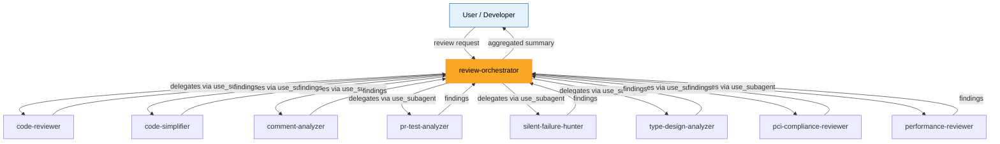
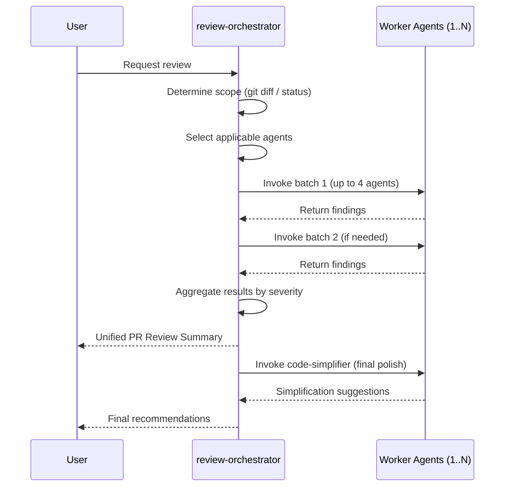
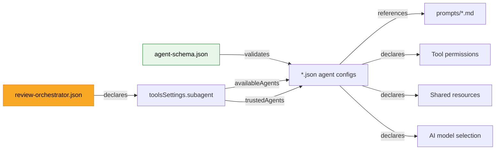

# System Architecture

## Architectural Pattern: Orchestrator–Worker Agent System

The kiro-starter-kit implements a hierarchical multi-agent architecture where a central orchestrator delegates specialized review tasks to independent worker agents that execute in parallel.

## Design Principles

1. **Separation of Concerns**: Each agent has a single, well-defined review domain (security, performance, types, etc.)
2. **Declarative Configuration**: Agents are defined via JSON config files referencing markdown prompts — no imperative code
3. **Parallel Execution**: The orchestrator can invoke up to 4 agents simultaneously, batching when more are needed
4. **Shared Context Model**: All agents share the same resource files (`AGENTS.md`, `README.md`, `.editorconfig`) for project-level context
5. **Uniform Tooling**: All worker agents share the same tool set (`fs_read`, `fs_write`, `execute_bash`, `grep`, `code`); only the orchestrator additionally has `use_subagent`

## Execution Flow

## Configuration Architecture

Each agent configuration follows a consistent structure:
- `$schema`: Points to `agent-schema.json` for validation
- `name`: Unique agent identifier
- `description`: Human-readable purpose
- `prompt`: `file://` reference to a markdown system prompt
- `model`: AI model to use (all use `claude-opus-4-6`)
- `tools`: Array of permitted tool names
- `resources`: Shared context files loaded into the agent
