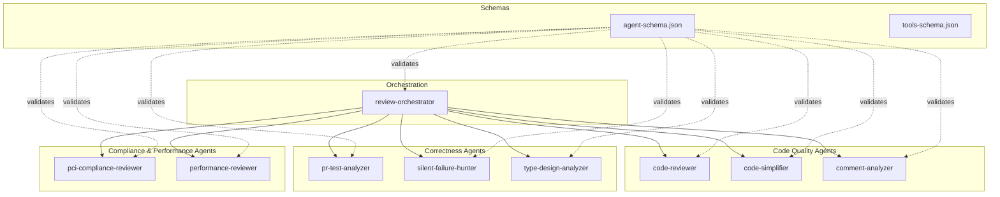

# Components

## Component Overview

## Orchestrator

### review-orchestrator
- **Config**: `.kiro/agents/review-orchestrator.json`
- **Prompt**: `.kiro/agents/prompts/review-orchestrator.md`
- **Role**: Coordinates the entire PR review workflow. Determines review scope via `git diff`/`git status`, selects applicable agents based on changed file types, invokes them in parallel batches of up to 4, and aggregates results into a unified severity-ranked summary.
- **Unique capability**: Only agent with `use_subagent` tool and `toolsSettings.subagent` configuration listing all 8 worker agents as both available and trusted.

## Code Quality Agents

### code-reviewer
- **Config**: `.kiro/agents/code-reviewer.json`
- **Prompt**: `.kiro/agents/prompts/code-reviewer.md`
- **Role**: General code quality review — project guidelines compliance, bug detection, code quality. Uses a confidence scoring system (0–100) and only reports issues with confidence ≥ 80. Groups findings by severity (Critical: 90–100, Important: 80–89).
- **When used**: Always applicable for any PR.

### code-simplifier
- **Config**: `.kiro/agents/code-simplifier.json`
- **Prompt**: `.kiro/agents/prompts/code-simplifier.md`
- **Role**: Simplifies code for clarity and maintainability while preserving exact functionality. Applies project standards (ES modules, `function` keyword preference, explicit return types, React patterns). Runs last as a final polish step after other reviews pass.
- **When used**: After all other reviews complete and issues are addressed.

### comment-analyzer
- **Config**: `.kiro/agents/comment-analyzer.json`
- **Prompt**: `.kiro/agents/prompts/comment-analyzer.md`
- **Role**: Analyzes code comments for factual accuracy, completeness, long-term value, and misleading elements. Advisory only — identifies issues and suggests improvements without modifying code directly.
- **When used**: When comments or documentation are added or modified.

## Correctness Agents

### pr-test-analyzer
- **Config**: `.kiro/agents/pr-test-analyzer.json`
- **Prompt**: `.kiro/agents/prompts/pr-test-analyzer.md`
- **Role**: Evaluates test coverage quality and completeness. Focuses on behavioral coverage over line coverage. Rates test recommendations on a 1–10 criticality scale. Pragmatic approach — prioritizes tests that prevent real bugs over academic completeness.
- **When used**: When test files are changed or new functionality is added.

### silent-failure-hunter
- **Config**: `.kiro/agents/silent-failure-hunter.json`
- **Prompt**: `.kiro/agents/prompts/silent-failure-hunter.md`
- **Role**: Audits error handling with zero tolerance for silent failures. Examines logging quality, user feedback, catch block specificity, fallback behavior, and error propagation. Flags empty catch blocks, broad exception catching, and hidden failures.
- **When used**: When error handling code is changed.

### type-design-analyzer
- **Config**: `.kiro/agents/type-design-analyzer.json`
- **Prompt**: `.kiro/agents/prompts/type-design-analyzer.md`
- **Role**: Evaluates type design for encapsulation quality, invariant expression, and enforcement. Rates types on four dimensions (encapsulation, invariant expression, usefulness, enforcement) each on a 1–10 scale. Flags anti-patterns like anemic domain models and exposed mutable internals.
- **When used**: When types are added or modified.

## Compliance & Performance Agents

### pci-compliance-reviewer
- **Config**: `.kiro/agents/pci-compliance-reviewer.json`
- **Prompt**: `.kiro/agents/prompts/pci-compliance-reviewer.md`
- **Role**: Reviews code for PCI-DSS compliance. Covers Requirements 3 (stored data protection), 4 (encryption in transit), 6 (secure development), and 10 (logging/monitoring). Performs data flow analysis, checks logging for card data leaks, validates encryption, and flags test data issues.
- **When used**: When code touches payment processing, card data, encryption, or related infrastructure.

### performance-reviewer
- **Config**: `.kiro/agents/performance-reviewer.json`
- **Prompt**: `.kiro/agents/prompts/performance-reviewer.md`
- **Role**: Reviews code for performance issues across database/I/O, algorithmic complexity, memory, concurrency, caching, and frontend concerns. Focuses on practical, measurable problems rather than premature optimization. Rates findings as CRITICAL, HIGH, or MEDIUM.
- **When used**: When code involves data processing, database queries, loops over collections, or resource allocation.

## Schema Components

### agent-schema.json
- **Location**: Root directory
- **Role**: JSON Schema (Draft 2020-12) that validates all agent configuration files. Defines the structure for agent properties including `name`, `prompt`, `model`, `tools`, `resources`, `mcpServers`, `hooks`, `toolsSettings`, and more.

### tools-schema.json
- **Location**: Root directory
- **Role**: Documents the complete tool interface specifications available to agents. Defines input schemas for tools like `execute_bash`, `code`, `fs_read`, `fs_write`, `grep`, `glob`, `web_search`, `web_fetch`, `use_aws`, and `use_subagent`.
