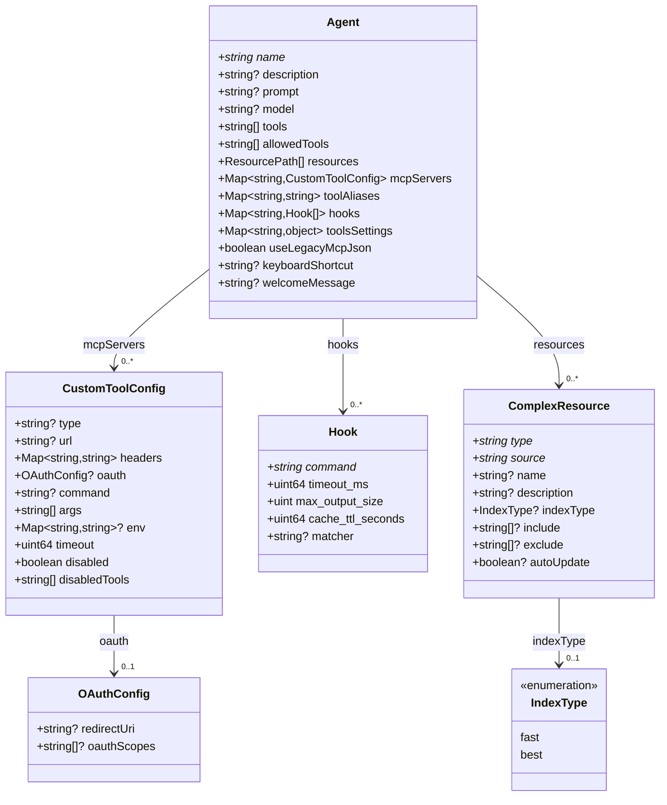

# Data Models

## Agent Configuration Model

Defined by `agent-schema.json` (JSON Schema Draft 2020-12).



### Required Fields
- `name` — Only required field; all others have defaults

### Key Relationships
- `ResourcePath` is a union type: plain string path, `file://` URI, or `ComplexResource` object
- `toolsSettings` is a free-form map keyed by tool name — the orchestrator uses it for `subagent.availableAgents` and `subagent.trustedAgents`
- `tools` array references tool names; MCP server tools use `@{SERVER_NAME}/tool_name` syntax

## Orchestrator Subagent Settings Model

The `review-orchestrator` uses a specialized `toolsSettings.subagent` structure:

```json
{
  "availableAgents": ["<agent-name>", ...],
  "trustedAgents": ["<agent-name>", ...]
}
```

- `availableAgents`: Agents the orchestrator can invoke
- `trustedAgents`: Agents that can execute without user confirmation

## Agent Output Models

Each agent produces structured output following its prompt-defined format. These are not formal schemas but consistent markdown structures:

| Agent | Output Structure |
|---|---|
| code-reviewer | Issues grouped by severity (Critical 90–100, Important 80–89) with confidence scores |
| code-simplifier | Refined code with documented changes |
| comment-analyzer | Critical Issues, Improvement Opportunities, Recommended Removals, Positive Findings |
| pr-test-analyzer | Summary, Critical Gaps, Important Improvements, Test Quality Issues, Positive Observations |
| silent-failure-hunter | Issues with Location, Severity, Description, Hidden Errors, User Impact, Recommendation |
| type-design-analyzer | Per-type ratings (Encapsulation, Expression, Usefulness, Enforcement) each 1–10 |
| pci-compliance-reviewer | PCI Compliance Summary with findings by requirement and compliance status |
| performance-reviewer | Issues with Location, Severity, Category, Impact Estimate, Recommendation |
| review-orchestrator | Aggregated PR Review Summary: Critical Issues, Important Issues, Suggestions, Strengths |
