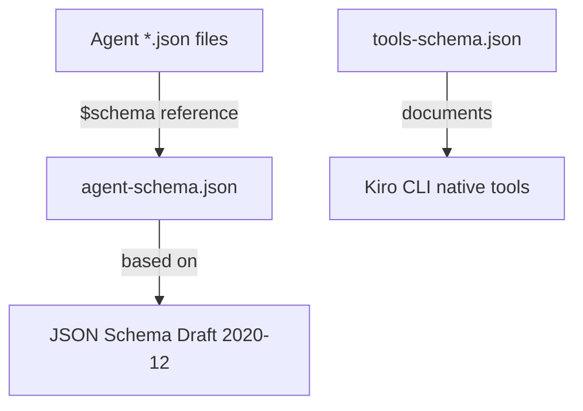

# Dependencies

## Runtime Dependencies

This is a configuration-only repository with no package manager dependencies (no `package.json`, `Cargo.toml`, `requirements.txt`, etc.).

### Platform Dependency

| Dependency | Version | Purpose |
|---|---|---|
| **Kiro CLI** | Required | AI assistant framework that loads and executes agent configurations |

### AI Model Dependency

| Model | Used By |
|---|---|
| `claude-opus-4-6` | All 9 agents (orchestrator + 8 workers) |

### External Tool Dependencies

Agents rely on tools provided by the Kiro CLI runtime:

| Tool | Purpose | Required By |
|---|---|---|
| `fs_read` | File and directory reading | All agents |
| `fs_write` | File creation and editing | All agents |
| `execute_bash` | Shell command execution | All agents |
| `grep` | Regex text search | All agents |
| `code` | LSP-powered code intelligence | All agents |
| `use_subagent` | Agent delegation | Orchestrator only |

### Implicit CLI Tool Dependencies

Agents invoke these CLI tools via `execute_bash`:

| Tool | Purpose | Required By |
|---|---|---|
| `git` | Diff analysis, status, log | Orchestrator + most workers |
| `gh` (GitHub CLI) | PR view, PR metadata | Orchestrator (optional) |

## Resource Dependencies

All agents expect these files to exist in the project where they are used:

| Resource | Purpose | Impact if Missing |
|---|---|---|
| `AGENTS.md` | Project coding guidelines and standards | Agents cannot enforce project-specific rules |
| `README.md` | Project overview context | Agents lack project understanding |
| `.editorconfig` | Formatting standards | Agents cannot verify formatting compliance |

These are not present in the starter kit itself — they are expected to exist in the target project where these agents are deployed.

## Schema Dependencies

- `agent-schema.json` — Validates all agent configuration files
- `tools-schema.json` — Documents tool input schemas (reference only, not used for runtime validation)
