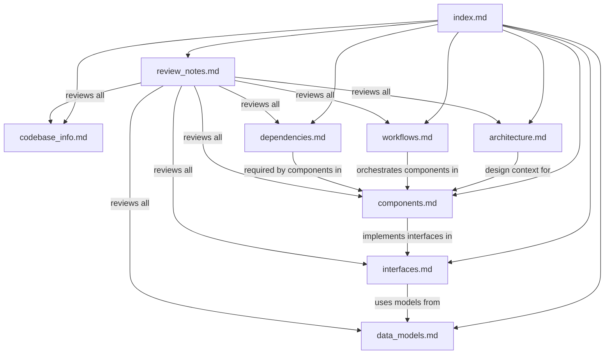

# Documentation Index — kiro-starter-kit

> **For AI Assistants**: This file is the primary entry point for understanding the kiro-starter-kit codebase. Read this file first to determine which detailed documentation files to consult for specific questions. Each entry below includes a summary sufficient to answer many questions without needing to read the full file.

## How to Use This Documentation

1. **Start here** — This index contains enough metadata to answer most high-level questions
2. **Dive deeper** — Follow links to specific files when you need implementation details
3. **Cross-reference** — Files reference each other; the relationships section below maps connections

## Documentation Files

### [codebase_info.md](./codebase_info.md)
**Purpose**: Basic project identity, technology stack, and file statistics.
**Consult when**: You need to know what the project is, what technologies it uses, or its file structure.
**Summary**: The kiro-starter-kit is a configuration-only repository (no application source code) containing 9 Kiro CLI agent configurations and their markdown prompts, plus 2 JSON schema files. All configs use JSON, all prompts use Markdown, and the AI model is Claude Opus 4.

### [architecture.md](./architecture.md)
**Purpose**: System architecture, design patterns, and execution flow.
**Consult when**: You need to understand how agents relate to each other, the orchestrator pattern, or the overall design philosophy.
**Summary**: Implements an orchestrator–worker pattern. The `review-orchestrator` receives review requests, determines scope via git, selects applicable worker agents, invokes them in parallel batches of up to 4, and aggregates results into a severity-ranked summary. All agents share the same tools and resources; only the orchestrator has `use_subagent`.

### [components.md](./components.md)
**Purpose**: Detailed description of each agent and schema component.
**Consult when**: You need to understand what a specific agent does, when it's used, or its configuration details.
**Summary**: 9 agents total — 1 orchestrator + 8 specialized workers covering code quality (code-reviewer, code-simplifier, comment-analyzer), correctness (pr-test-analyzer, silent-failure-hunter, type-design-analyzer), and compliance/performance (pci-compliance-reviewer, performance-reviewer). Plus 2 schema files for validation and tool documentation.

### [interfaces.md](./interfaces.md)
**Purpose**: APIs, tool interfaces, and integration points.
**Consult when**: You need to understand how agents are configured, what tools they use, how subagent delegation works, or how to extend with MCP servers.
**Summary**: Agents are configured via JSON conforming to `agent-schema.json`. Workers use 5 tools (fs_read, fs_write, execute_bash, grep, code). The orchestrator additionally uses `use_subagent` to delegate. Resources (AGENTS.md, README.md, .editorconfig) provide project context. MCP servers and hooks are supported but not currently configured.

### [data_models.md](./data_models.md)
**Purpose**: Data structures, schemas, and output formats.
**Consult when**: You need to understand the agent configuration schema, its fields and types, or what output each agent produces.
**Summary**: The `Agent` model (defined in agent-schema.json) has `name` as the only required field, with optional prompt, model, tools, resources, mcpServers, hooks, and toolsSettings. Each agent produces structured markdown output in a domain-specific format (confidence scores, severity ratings, compliance status, etc.).

### [workflows.md](./workflows.md)
**Purpose**: Key processes, execution flows, and how-to guides.
**Consult when**: You need to understand the review workflow end-to-end, agent selection logic, or how to add a new agent.
**Summary**: The primary workflow is orchestrated PR review: scope determination → agent selection → parallel invocation → result aggregation → optional re-review → final code-simplifier polish. Adding a new agent requires creating a prompt .md, a config .json, updating the orchestrator's availableAgents/trustedAgents, and updating the orchestrator prompt.

### [dependencies.md](./dependencies.md)
**Purpose**: External dependencies and their usage.
**Consult when**: You need to know what the project depends on, what tools agents need, or what files must exist in the target project.
**Summary**: No package manager dependencies. Requires Kiro CLI runtime, Claude Opus 4 model access, and git. Optional: GitHub CLI (`gh`). Agents expect AGENTS.md, README.md, and .editorconfig to exist in the target project (not included in the starter kit).

### [review_notes.md](./review_notes.md)
**Purpose**: Documentation quality review — consistency issues, completeness gaps, and recommendations.
**Consult when**: You need to understand documentation limitations or areas needing improvement.
**Summary**: High consistency across agent configs. Key gaps: no README, no example AGENTS.md template, no usage instructions, no customization guide, and resource files (AGENTS.md, README.md, .editorconfig) are referenced but not included.

## File Relationships

## Quick Reference

| Question | File |
|---|---|
| What is this project? | codebase_info.md |
| How do agents work together? | architecture.md |
| What does agent X do? | components.md |
| How do I configure an agent? | interfaces.md, data_models.md |
| What's the review workflow? | workflows.md |
| What does this project depend on? | dependencies.md |
| What's missing or inconsistent? | review_notes.md |
| How do I add a new agent? | workflows.md |
