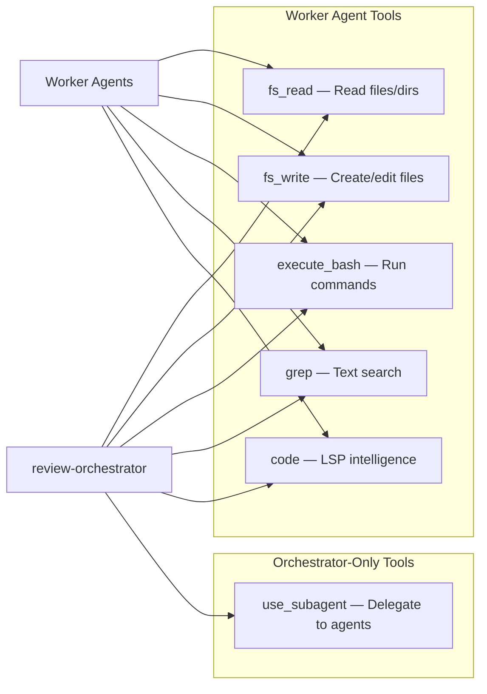

# Interfaces & Integration Points

## Agent Configuration Interface

All agents conform to the schema defined in `agent-schema.json`. The core interface for an agent configuration:

```json
{
  "$schema": "../../agent-schema.json",
  "name": "<string, required>",
  "description": "<string, optional>",
  "prompt": "<string, file:// reference to .md prompt>",
  "model": "<string, AI model ID>",
  "tools": ["<tool_name>", ...],
  "resources": ["file://<path>", ...],
  "toolsSettings": { ... },
  "mcpServers": { ... },
  "hooks": { ... }
}
```

## Tool Interface

Agents interact with the environment through a defined set of tools. Each tool has a specific input schema documented in `tools-schema.json`.



### Tool Summary

| Tool | Purpose | Used By |
|---|---|---|
| `fs_read` | Read file contents, list directories, search patterns | All agents |
| `fs_write` | Create, edit, append to files | All agents |
| `execute_bash` | Execute shell commands (git diff, git status, etc.) | All agents |
| `grep` | Regex-based text search across files | All agents |
| `code` | LSP-powered code intelligence (symbols, references, diagnostics) | All agents |
| `use_subagent` | Delegate tasks to other named agents | Orchestrator only |

## Subagent Delegation Interface

The orchestrator invokes worker agents via `use_subagent` with this interface:

```json
{
  "command": "InvokeSubagents",
  "content": {
    "subagents": [
      {
        "query": "<description of what to review>",
        "agent_name": "<agent name from availableAgents>",
        "relevant_context": "<file paths and focus areas>"
      }
    ]
  }
}
```

Constraints:
- Maximum 4 agents per parallel batch
- `code-simplifier` must run last, after all other reviews complete
- Agents are both `availableAgents` and `trustedAgents` (can execute without confirmation)

## Resource Interface

All agents load shared context files via the `resources` array:

| Resource | Purpose |
|---|---|
| `file://AGENTS.md` | Project-level guidelines and coding standards |
| `file://README.md` | Project overview and documentation |
| `file://.editorconfig` | Editor formatting configuration |

These files are loaded into the agent's context at session start and provide the project-specific rules that agents enforce during reviews.

## MCP Server Interface

The agent schema supports Model Context Protocol (MCP) server integration for extending agent capabilities with external tools:

```json
{
  "mcpServers": {
    "<server-name>": {
      "type": "stdio | http | registry",
      "command": "<command>",
      "args": ["<arg>"],
      "env": { "<key>": "<value>" },
      "url": "<http endpoint>",
      "timeout": 30000,
      "disabled": false,
      "disabledTools": ["<tool_name>"]
    }
  }
}
```

No MCP servers are currently configured in the starter kit, but the schema supports them for extensibility.

## Hooks Interface

Agents support lifecycle hooks for running commands at specific events:

```json
{
  "hooks": {
    "<event-name>": [
      {
        "command": "<shell command>",
        "timeout_ms": 30000,
        "max_output_size": 10240,
        "cache_ttl_seconds": 0,
        "matcher": "<glob pattern>"
      }
    ]
  }
}
```

No hooks are currently configured in the starter kit agents.
