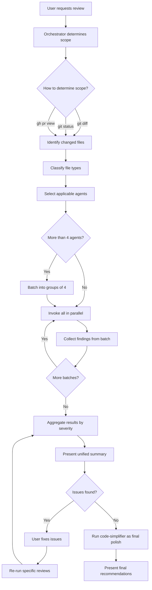
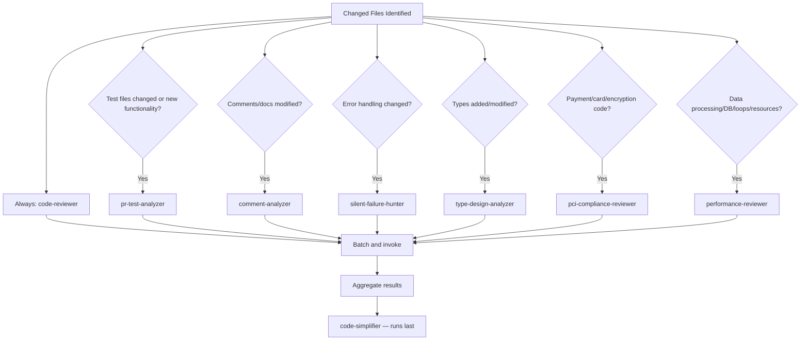
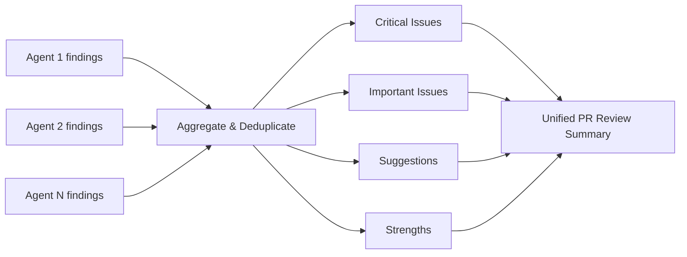

# Workflows

## Primary Workflow: Orchestrated PR Review

## Agent Selection Logic

## Agent Invocation Workflow

Each worker agent follows this internal workflow:

1. **Receive scope** — File paths and focus areas from orchestrator
2. **Analyze changes** — Use `git diff`, `fs_read`, `code` tools to examine the code
3. **Apply domain expertise** — Evaluate against domain-specific criteria defined in the prompt
4. **Generate structured findings** — Produce findings in the agent's defined output format
5. **Return to orchestrator** — Findings are collected and aggregated

## Result Aggregation Workflow

The orchestrator aggregates all agent findings into a unified summary:

## Adding a New Agent Workflow

To add a new specialized review agent:

1. Create `.kiro/agents/prompts/<agent-name>.md` with the system prompt
2. Create `.kiro/agents/<agent-name>.json` with the agent configuration
3. Add the agent name to `review-orchestrator.json` → `toolsSettings.subagent.availableAgents` and `trustedAgents`
4. Update the orchestrator prompt (`.kiro/agents/prompts/review-orchestrator.md`) to describe when to use the new agent
