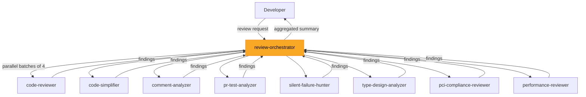

# AGENTS.md — kiro-starter-kit

> AI assistant context file for the kiro-starter-kit repository. This file provides everything an AI assistant needs to understand the project structure, components, and development patterns.

<!-- tags: overview, project-context, ai-assistant -->

## Table of Contents

- [Project Overview](#project-overview) — What this project is and its purpose
- [Directory Structure](#directory-structure) — File organization and layout
- [Architecture](#architecture) — Orchestrator–worker agent pattern
- [Agent Reference](#agent-reference) — All 9 agents and their roles
- [Configuration Schema](#configuration-schema) — How agents are configured
- [Tool Reference](#tool-reference) — Available tools and their usage
- [Workflows](#workflows) — Review process and agent lifecycle
- [Adding New Agents](#adding-new-agents) — How to extend the system
- [Dependencies & Prerequisites](#dependencies--prerequisites) — What's needed to run
- [Known Gaps](#known-gaps) — Areas needing attention

---

## Project Overview
<!-- tags: identity, purpose, tech-stack -->

The kiro-starter-kit is a collection of pre-built, specialized AI agent configurations for the Kiro CLI. It implements an orchestrated PR code review system where a central orchestrator delegates review tasks to 8 specialized worker agents that run in parallel.

- **Type**: Configuration-only repository (no application source code)
- **Format**: JSON configs + Markdown prompts
- **AI Model**: All agents use `claude-opus-4-6`
- **Origin**: Converted from Claude PR toolkit to Kiro agents (commit `3bcc066`)

---

## Directory Structure
<!-- tags: files, layout, organization -->

```
kiro-starter-kit/
├── .kiro/
│   ├── agents/                          # Agent configurations
│   │   ├── code-reviewer.json
│   │   ├── code-simplifier.json
│   │   ├── comment-analyzer.json
│   │   ├── pci-compliance-reviewer.json
│   │   ├── performance-reviewer.json
│   │   ├── pr-test-analyzer.json
│   │   ├── review-orchestrator.json     # Main orchestrator
│   │   ├── silent-failure-hunter.json
│   │   ├── type-design-analyzer.json
│   │   └── prompts/                     # Agent system prompts
│   │       ├── code-reviewer.md
│   │       ├── code-simplifier.md
│   │       ├── comment-analyzer.md
│   │       ├── pci-compliance-reviewer.md
│   │       ├── performance-reviewer.md
│   │       ├── pr-test-analyzer.md
│   │       ├── review-orchestrator.md
│   │       ├── silent-failure-hunter.md
│   │       └── type-design-analyzer.md
│   ├── prompts/                         # Reserved (empty)
│   └── settings/
│       └── lsp.json                     # LSP configuration
├── agent-schema.json                    # JSON Schema for agent configs
└── tools-schema.json                    # Tool interface documentation
```

---

## Architecture
<!-- tags: design, pattern, orchestrator, parallel -->



**Pattern**: Orchestrator–Worker with parallel execution (up to 4 concurrent agents).

**Key design decisions**:
- Each agent has a single review domain (separation of concerns)
- Agents are declaratively configured via JSON + Markdown (no imperative code)
- All workers share the same tool set; only the orchestrator has `use_subagent`
- `code-simplifier` always runs last as a final polish step

---

## Agent Reference
<!-- tags: agents, components, roles -->

### Orchestrator

| Agent | Description |
|---|---|
| **review-orchestrator** | Coordinates PR reviews: determines scope, selects agents, invokes in parallel, aggregates results |

### Workers

| Agent | Domain | When Used |
|---|---|---|
| **code-reviewer** | General code quality, guidelines compliance, bug detection | Always |
| **code-simplifier** | Code clarity and maintainability (preserves functionality) | Last, after other reviews pass |
| **comment-analyzer** | Comment accuracy, completeness, long-term value | When comments/docs are modified |
| **pr-test-analyzer** | Test coverage quality and completeness | When tests change or new functionality added |
| **silent-failure-hunter** | Error handling, silent failures, catch block quality | When error handling code changes |
| **type-design-analyzer** | Type encapsulation, invariant expression and enforcement | When types are added/modified |
| **pci-compliance-reviewer** | PCI-DSS compliance (Requirements 3, 4, 6, 10) | When code touches payments/encryption |
| **performance-reviewer** | Algorithmic complexity, memory, I/O, concurrency | When code involves data processing/DB/loops |

### Shared Configuration

All agents share:
- **Model**: `claude-opus-4-6`
- **Tools**: `fs_read`, `fs_write`, `execute_bash`, `grep`, `code` (orchestrator adds `use_subagent`)
- **Resources**: `AGENTS.md`, `README.md`, `.editorconfig` (from target project)

---

## Configuration Schema
<!-- tags: schema, config, json -->

Agent configs conform to `agent-schema.json` (JSON Schema Draft 2020-12). Minimal config:

```json
{
  "$schema": "../../agent-schema.json",
  "name": "my-agent",
  "prompt": "file://./prompts/my-agent.md",
  "model": "claude-opus-4-6",
  "tools": ["fs_read", "fs_write", "execute_bash", "grep", "code"],
  "resources": ["file://AGENTS.md", "file://README.md", "file://.editorconfig"]
}
```

Key fields: `name` (required), `description`, `prompt` (file:// reference), `model`, `tools`, `resources`, `mcpServers`, `hooks`, `toolsSettings`, `keyboardShortcut`, `welcomeMessage`.

See `agent-schema.json` for the complete schema and `.agents/summary/data_models.md` for detailed field documentation.

---

## Tool Reference
<!-- tags: tools, capabilities -->

| Tool | Purpose |
|---|---|
| `fs_read` | Read files, list directories, search within files |
| `fs_write` | Create, edit, insert, append to files |
| `execute_bash` | Run shell commands (git diff, git status, etc.) |
| `grep` | Regex-based text search across files |
| `code` | LSP-powered code intelligence (symbols, references, diagnostics, AST search) |
| `use_subagent` | Delegate tasks to named agents (orchestrator only) |

Full tool schemas are documented in `tools-schema.json`.

---

## Workflows
<!-- tags: process, review, lifecycle -->

### PR Review Flow

1. User requests review → orchestrator determines scope via `git diff`/`git status`
2. Orchestrator selects applicable agents based on changed file types
3. Agents invoked in parallel batches of up to 4
4. Results aggregated into unified summary (Critical → Important → Suggestions → Strengths)
5. User fixes issues → optional re-review of specific agents
6. `code-simplifier` runs as final polish

### Aggregated Output Format

```markdown
# PR Review Summary
## Critical Issues (X found)
- [agent-name]: Issue description [file:line]
## Important Issues (X found)
- [agent-name]: Issue description [file:line]
## Suggestions (X found)
- [agent-name]: Suggestion [file:line]
## Strengths
- What's well-done in this PR
```

---

## Adding New Agents
<!-- tags: extension, customization -->

1. Create `.kiro/agents/prompts/<agent-name>.md` — system prompt defining the agent's expertise and output format
2. Create `.kiro/agents/<agent-name>.json` — configuration referencing the prompt, model, tools, and resources
3. Add agent name to `review-orchestrator.json` → `toolsSettings.subagent.availableAgents` and `trustedAgents`
4. Update `.kiro/agents/prompts/review-orchestrator.md` — add the agent to the selection criteria with a description of when to use it

---

## Dependencies & Prerequisites
<!-- tags: dependencies, requirements, setup -->

| Dependency | Required | Purpose |
|---|---|---|
| Kiro CLI | Yes | Runtime that loads and executes agent configurations |
| Claude Opus 4 model access | Yes | AI model used by all agents |
| Git | Yes | Scope determination (diff, status, log) |
| GitHub CLI (`gh`) | Optional | PR metadata retrieval |

### Target Project Requirements

Agents expect these files in the project where they're deployed:
- `AGENTS.md` — Project coding guidelines (agents enforce these rules)
- `README.md` — Project overview context
- `.editorconfig` — Formatting standards

---

## Known Gaps
<!-- tags: gaps, improvements, todo -->

- No README.md, AGENTS.md template, or .editorconfig included in the starter kit
- No usage/installation instructions
- No example review output
- `code-simplifier` prompt is JS/TS-focused but described as language-agnostic
- `gh` CLI dependency is implicit (not documented as prerequisite)
- `.kiro/prompts/` directory exists but is empty with no documented purpose

See `.agents/summary/review_notes.md` for the full consistency and completeness review.
