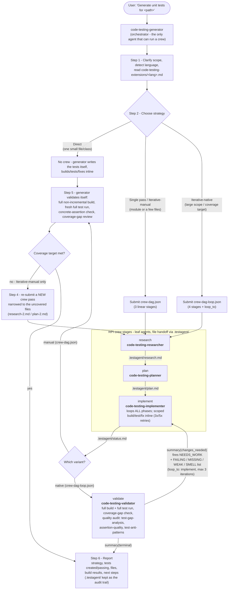

# dotnet-test-creator

A Kiro plugin that generates comprehensive, _verified_ unit tests for any language using an
orchestrated **Research → Plan → Implement (→ Validate)** agent pipeline, backed by a library
of test-quality and .NET test-framework skills.

Despite the name, the pipeline is **polyglot** — language specifics (framework detection,
build/test commands, project registration, common errors) live in per-language extension files
under `skills/code-testing-extensions/extensions/` (.NET, Python, TypeScript, Go, Java, Rust,
Ruby, Swift, Kotlin, PowerShell, C++). The ".NET" part of the name reflects the extra depth of
the .NET-specific skills (MSTest/TUnit authoring, framework migrations, CRAP scores, etc.).

## Quick start

```bash
kiro-cli chat --agent code-testing-generator
# then: "Generate unit tests for <path>"
```

After a run, `.testagent/` (`research.md`, `plan.md`, `status.md`) is intentionally left in
place as the audit trail — add it to `.gitignore`.

## Agent flow

Everything starts with `code-testing-generator` ([agents/prompts/code-testing-generator.md](agents/prompts/code-testing-generator.md)) —
the **only** agent allowed to run a crew. The four stage agents are leaves: they cannot spawn
anything, and they hand off through files in `.testagent/` on the shared working directory
(the crew tool only substitutes `{task}` into each stage's prompt; it never pipes one stage's
output into the next — ordering comes from `depends_on`, data comes from the files).



## The agents

### `code-testing-generator` — orchestrator

**Purpose:** Coordinates the whole run. The only agent with the `subagent` (crew) tool.

**Methodology:**

1. Clarifies scope (file / module / project) and reads the matching language extension up front.
2. Picks one of three strategies — **Direct** (small single file: skip the crew, write tests
   itself), **Single pass** (one RPI crew run), or **Iterative** (large scope or a coverage
   target; manual or native loop — see [Two iteration variants](#two-iteration-variants)).
3. For the manual variants, runs final validation itself: full non-incremental build, fresh
   full test run, a "would this test still pass with the function body emptied?" assertion
   check, and a coverage-gap review.
4. Reports, leaving `.testagent/` in place as the run's audit trail.

Hard rules it enforces: never modify production code to make it testable; fix assertions
rather than skip/ignore tests; full build + test + coverage review are mandatory for every
strategy, including Direct.

### `code-testing-researcher` — stage 1

**Purpose:** Analyzes the codebase so later stages don't have to rediscover it. Writes
`.testagent/research.md`; never writes tests or touches source.

**Methodology:** Discovers project/build files and the test framework; determines scope;
enumerates the public API surface with AST/symbol tools (reading bodies where needed); builds a
**leaf-first dependency graph** (leaf types test directly; their dependents mock them);
discovers build/test/lint commands; inventories existing tests and estimates per-file coverage
(untested / partial / well-tested); prioritizes files to test (High/Medium/Low with
testability ratings).

### `code-testing-planner` — stage 2

**Purpose:** Turns the research into a phased implementation plan. Writes `.testagent/plan.md`;
never writes tests or runs commands.

**Methodology:** Reads `research.md`, chooses a broad vs. targeted strategy from the
estimated-coverage data, and groups **every** in-scope file into 2–5 phases ordered leaf-first.
Each phase specifies target files, methods/scenarios (happy path, edge cases, error cases),
which dependencies to mock, and concrete success criteria. Hard-to-test symbols
(sealed/internal/no seam) are recorded as follow-ups — never as production-code changes.

### `code-testing-implementer` — stage 3

**Purpose:** Writes the test files _and_ verifies them. The former `builder`/`tester`/`fixer`/
`linter` agents are intentionally collapsed into its own inline shell calls (Kiro subagents
cannot spawn subagents). Appends a result block per phase to `.testagent/status.md`.

**Methodology:** For each phase in order: read the source **in full** (never write tests from
signatures alone — verify actual return values before asserting); register new test projects
with the build system; write tests covering happy path / edge / error cases with all external
dependencies mocked; **build scoped** to the affected test project (retry up to 3×); **run
tests scoped** (retry up to 5×), fixing assertions against real production behavior — never
`[Ignore]`/`[Skip]`. Edit boundaries: existing test files are append-only; production code is
never modified. On **loop re-entry** (native variant) it addresses only what the validator's
categorized feedback names, without redoing phases already marked `SUCCESS`.

### `code-testing-validator` — stage 4 (native-loop variant only)

**Purpose:** Final whole-suite validation plus a test-quality audit, and the agent that
**drives the loop**. Never writes tests.

**Methodology:** Runs a full non-incremental build (all target frameworks) and a fresh full
test run; compares in-scope sources against tests created for coverage gaps; then applies
three quality-audit skills (rather than hand-rolling the checks):

- **`test-gap-analysis`** — pseudo-mutation: would the test fail if the code were broken?
- **`assertion-quality`** — flags shallow, assertion-free, or tautological assertions.
- **`test-anti-patterns`** — severity-ranked audit (flakiness, swallowed exceptions, missing `await`, …).

If anything fails, it calls the built-in `summary` tool with `resultType="changes_needed"` and
the token `NEEDS_WORK` plus a categorized **FAILING / MISSING / WEAK / SMELL** list — this
fires `loop_to → implement` (engine-bounded, `max_iterations: 3`), and the engine passes that
feedback to the implementer as context. Otherwise it returns `resultType="terminal"` with the
final report.

## Two iteration variants

| Variant    | Payload                                               | How iteration works                                                                                                                  | Loop bound                       |
| ---------- | ----------------------------------------------------- | ------------------------------------------------------------------------------------------------------------------------------------ | -------------------------------- |
| **Manual** | [`crew-dag.json`](crew-dag.json) (3 stages)           | The generator validates in its own turns and re-submits a _new_ crew pass narrowed to uncovered files (`research-2.md`, `plan-2.md`) | Orchestrator judgment            |
| **Native** | [`crew-dag-loop.json`](crew-dag-loop.json) (4 stages) | The `validate` stage fires `loop_to → implement` with `NEEDS_WORK` + categorized feedback                                            | Engine-enforced `max_iterations` |

Prefer the **native** variant for a robust, engine-bounded loop. Cycles are never expressed in
`depends_on` edges — iteration exists only via `loop_to`.

## IDE variants

`agents/code-testing-*-ide.md` and `skills/code-testing-agent-ide/` are a parallel set for IDE
environments without a CLI crew engine: **the main agent acts as the orchestrator**, launching
the researcher / planner / implementer / validator subagents in sequence and driving the fix
loop itself. The stage methodology and the `.testagent/` file contracts are identical.

## Supporting skills

The agents lean on a skill library instead of baking knowledge into prompts:

**Pipeline core**

- `code-testing-agent` / `code-testing-agent-ide` — the pipeline's default conventions and entry-point skill
- `code-testing-extensions` — per-language build/test/registration guidance (dispatcher + `extensions/<lang>.md>`)
- `test-analysis-extensions` — per-language assertion/smell APIs for the analysis skills

**Test-quality analysis** (used by the validator)

- `test-gap-analysis` — pseudo-mutation analysis to find tests that verify nothing
- `assertion-quality` — assertion depth/diversity audit
- `test-anti-patterns` — severity-ranked anti-pattern audit
- `test-smell-detection` — opt-in deep dive using the academic 19-smell catalog (testsmells.org)
- `test-tagging` — tags tests with standardized traits (boundary, smoke, regression, …)

**.NET coverage & testability**

- `coverage-analysis` / `crap-score` — coverage + CRAP (Change Risk Anti-Patterns) scoring
- `detect-static-dependencies` / `generate-testability-wrappers` / `migrate-static-to-wrapper` — find and abstract hard-to-test statics (`DateTime.Now`, `File.*`, `HttpClient`, …)

**.NET framework authoring & migration**

- `writing-mstest-tests`, `writing-tunit-tests`, `tunit-mocking`, `tunit-aot-compatibility`
- `migrate-mstest-v1v2-to-v3`, `migrate-mstest-v3-to-v4`, `migrate-xunit-to-xunit-v3`, `migrate-to-tunit`, `migrate-vstest-to-mtp`
- `run-tests`, `mtp-hot-reload`, plus reference data: `dotnet-test-frameworks`, `platform-detection`, `filter-syntax`

## Permissions

- The **generator** and **implementer** auto-approve common build/test commands (a polyglot
  allowlist: `dotnet`, `npm`/`npx`/`pnpm`/`yarn`, `pytest`, `go`, `cargo`, `mvn`, `gradle`)
  and writes under the workspace (`.git/**` denied).
- The **researcher**, **planner**, and **validator** can only write to `.testagent/**`.
- `toolsSettings.crew` (the documented key; `agent_crew` is its alias) holds
  `availableAgents`/`trustedAgents`. The crew tool itself is granted as `subagent` in the
  generator's `tools` — and only there; the stage agents cannot spawn anything.
